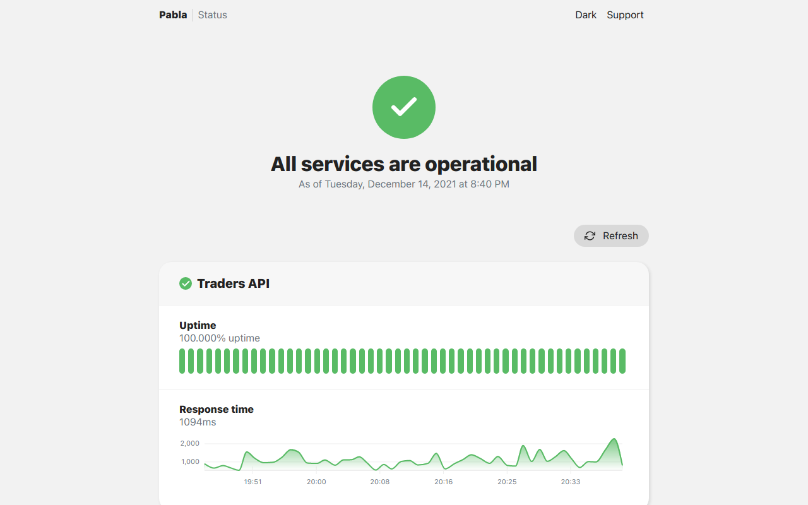

<br />
<div align="center">
  <a href="">
    
  </a>

  <h3 align="center">Cronitor Status Page (self-hosted)</h3>

  <p align="center">
    Create beautiful status pages for your applications in minutes
    <br />
    <a href="https://cronitor.io/docs"><strong>Explore Cronitor docs »</strong></a>
    <br />
    <br />
    <a href="https://cronitor-statuspage.vercel.app">View Demo</a>
    ·
    <a href="https://cronitor.io">Visit Cronitor</a>
  </p>
</div>

This project provides ability to create self-hosted status pages for [Cronitor](https://Cronitor.io/) which is a simple monitoring system. Cronitor provides performance insights and uptime monitoring for cron jobs, websites, APIs and more.

We also offer [hosted status pages](https://cronitor.io/status-pages) with full incident communication and customization options. Check out our [demo status page](https://cronitor.cronitorstatus.com) to try it out.



## Getting Started

First, create a [Cronitor](https://cronitor.io/signup) account and setup your monitors. [Read cronitor guides](https://cronitor.io/docs/guides)

Then in your Cronitor dashboard go to Settings and look for [API](https://cronitor.io/app/settings/api) section. There you can find your API keys which we're gonna use to setup your status page. Copy your API key!

Clone this project: 

```bash
git clone https://github.com/cronitorio/cronitor-statuspage.git
```

Duplicate ```.env.sample``` and rename it to ```.env```, then fill the placeholder variables with your own:

```bash
cp .env.sample .env
nano .env
```

That's it, your status page is ready!

## Deployment
To deploy the project to a production environment:

```bash
yarn
yarn build
yarn start
```

## Development
First install dependencies and then run the development server:

```bash
npm run dev
# or
yarn dev
```

Open [http://localhost:3000](http://localhost:3000) with your browser to see the result.


## Deploy on Vercel

The easiest way to deploy your status page is to use the [Vercel Platform](https://vercel.com/new).


[](https://vercel.com/new/clone?repository-url=https%3A%2F%2Fgithub.com%2Fcronitorio%2Fcronitor-statuspage&env=NEXT_PUBLIC_NAME,CRONITOR_API_KEY&envDescription=CRONITOR_API_KEY%3A%20Your%20Cronitor%20API%20key%2C%20NEXT_PUBLIC_NAME%3A%20Your%20brand%20name%20in%20top%20navbar.&envLink=https%3A%2F%2Fgithub.com%2Fcronitorio%2Fcronitor-statuspage%2Fblob%2Fmain%2F.env.sample&project-name=status-page&repository-name=status-page&redirect-url=https%3A%2F%2Fcronitor.io%2F&demo-title=Cronitor%20StatusPage%20Demo&demo-description=A%20sample%20status%20page%20created%20by%20Cronitor%20StatusPage&demo-url=https%3A%2F%2Fcronitor-statuspage.vercel.app%2F&demo-image=https%3A%2F%2Fraw.githubusercontent.com%2Fcronitorio%2Fcronitor-statuspage%2Fmain%2Fdocs%2Fdemo.png)
